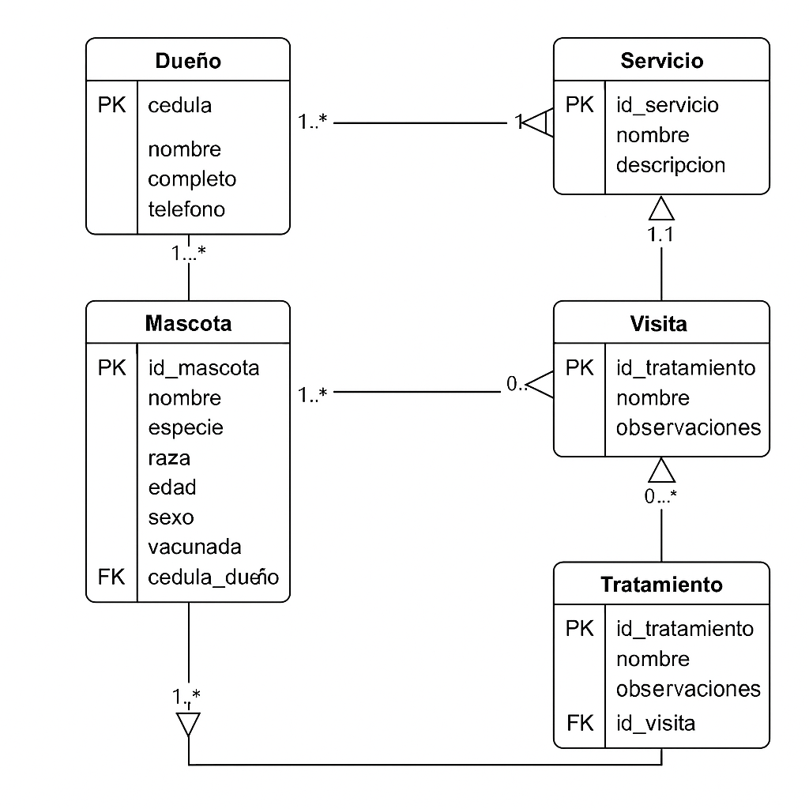

# 🐾 Veterinaria Mi Mejor Amigo

Este proyecto implementa una base de datos relacional para la veterinaria **"Mi Mejor Amigo"**, con el fin de mejorar el registro de sus operaciones diarias: atención médica, estética y tratamientos para mascotas.

## 📦 Estructura del Proyecto

- `estructura.sql` → Script con las instrucciones `CREATE TABLE`.
- `datos.sql` → Script con inserciones de prueba (`INSERT INTO`).
- `consultas.sql` → Script con 15 consultas SQL (DQL) que aplican funciones, alias, joins y más.
- `diagrama.png` → Imagen del diagrama UML con entidades, relaciones y cardinalidades.
- `README.md` → Este archivo con la documentación del proyecto.
- `link al video` → Explicación del modelo y las consultas.

---

## 🧠 Modelo Entidad-Relación

### Entidades principales:

- **Dueño:** cédula, nombre, teléfono, dirección.
- **Mascota:** nombre, especie, raza, edad, sexo, vacunación.
- **Servicio:** nombre, descripción, precio.
- **Visita:** fecha, servicio realizado, mascota atendida.
- **Tratamiento:** nombre, observaciones, asociado a una visita.

---

## ⚙️ Scripts

### 1. `estructura.sql` (DDL)
Crea las tablas con sus llaves primarias y foráneas, y define las relaciones entre entidades.

### 2. `datos.sql` (DML)
Contiene al menos:
- 5 dueños
- 10 mascotas
- 5 servicios
- 10 visitas
- 5 tratamientos

### 3. `consultas.sql` (DQL)
Contiene 15 consultas SQL que incluyen:
- Alias en campos y subconsultas
- Funciones (`COUNT`, `AVG`, `ROUND`, `SUBSTRING`, `IF`, etc.)
- Creación de tablas a partir de consultas
- `JOIN`, `GROUP BY`, `ORDER BY`
- `CONCAT`, `UPPER`, `LENGTH`, entre otras

---

## 🎥 Video Explicativo

En este video se explica el modelo de datos, las relaciones entre entidades y la lógica de las consultas SQL:

📺 **[Ver video en YouTube](https://youtu.be/TU_LINK_AQUI)**  

---

## 👨‍💻 Autor

- Carlos Daniel Arauz Sanjuan  
- Bootcamp Campuslands – Proyecto de Base de Datos  
- Mayo 2025

---

## ✅ Requisitos Técnicos

- Motor de base de datos: MySQL workbench
- Editor recomendado: VS Code 
- Herramienta para modelado: Draw.io 

---

## 📝 Licencia

Este proyecto es académico y fue desarrollado como parte de la formación en bases de datos. Puedes usarlo como referencia para fines educativos.